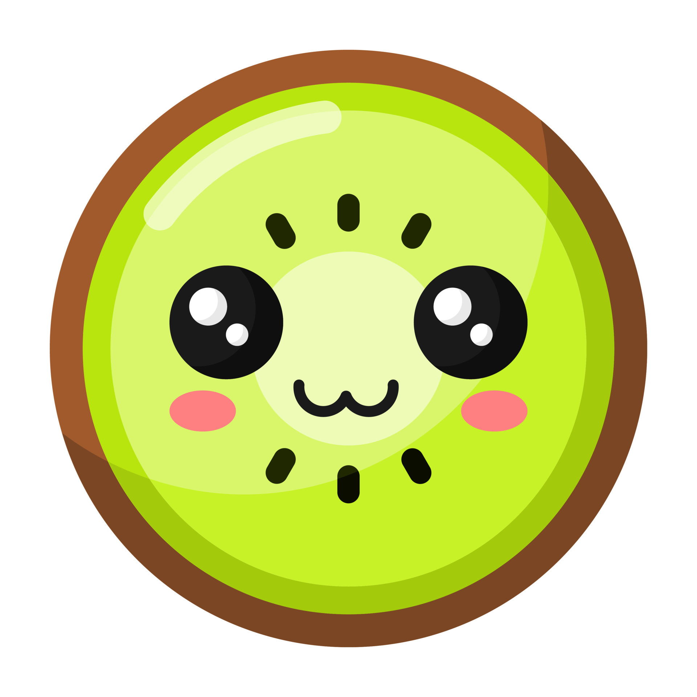
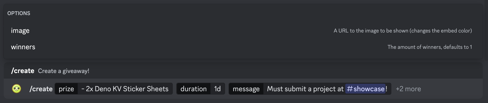
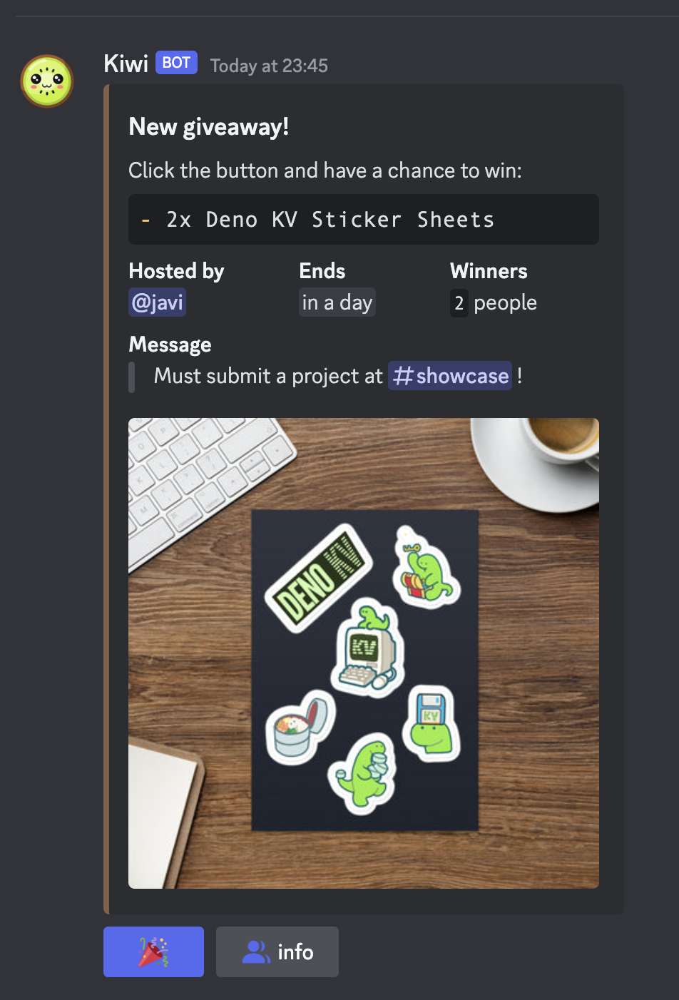
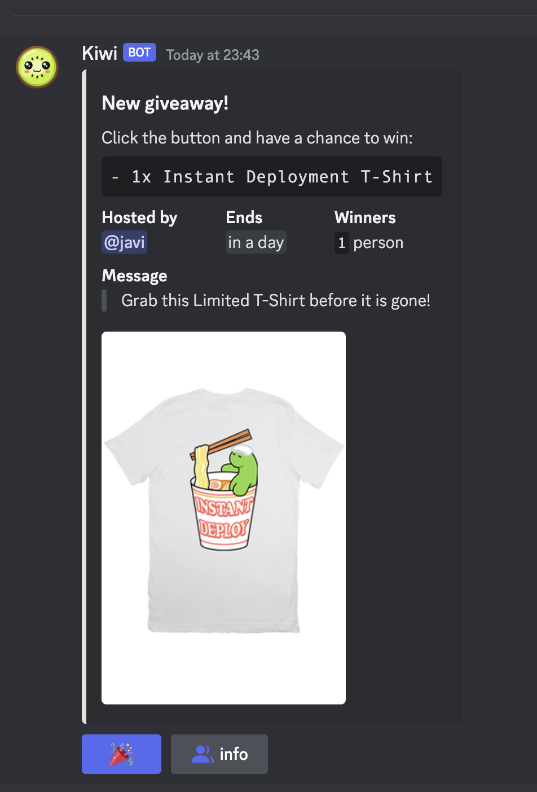
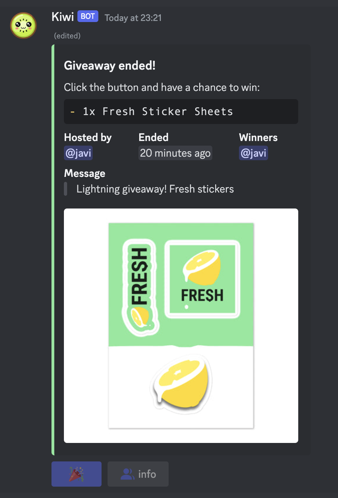

# kiwi

Discord giveaway bot written with TypeScript using
[Deno KV's](https://deno.com/kv) new features:

- **listenQueue**: Listen for queue values to be delivered from the database
  queue, which were enqueued with `Deno.Kv.enqueue`.
- **enqueue**: Add a value into the database queue to be delivered to the queue
  listener via `Deno.Kv.listenQueue`.

Create giveaways and let your users participate with a single click. Leverage
the power of Deno KV's new features to create a scalable and reliable way to
`schedule` tasks in the future.

Invite the bot to your server and start using it today by clicking
[this](https://discord.com/api/oauth2/authorize?client_id=1150897694156537948&permissions=3072&scope=bot%20applications.commands)
link.

# commands

- **create**: Creates a giveaway with the following arguments:
  - `prize`: The prize of the giveaway, supports markdown syntax highlighting.
  - `duration`: The time the giveaway will last, supports human readable time
    formats.
  - `message`: The message shown in the giveaway embed, can be used to add
    additional information about the giveaway.
  - `image`: Optional image url to be shown in the giveaway embed. Modifies the
    color of the embed to match the image.
  - `winners`: The amount of winners the giveaway will have.

# creating a giveaway

1. First of all, go to the channel you want to create the giveaway in and fill
   in the `/create` command with the required arguments.



2. After the giveaway has been created, the bot will send a message with the
   giveaway embed and a button to enter the giveaway.

<div>
    
    
    
</div>

3. Click the button to enter the giveaway. If you win, your username will be
   mentioned in the giveaway embed.

   

# feedback

- straightforward API for `enqueue` and `listenQueue`
- great usecase for a wide range of applications
- will definitely use this in the future
- docs still need some work, how do I mock `listenQueue` errors?
- don't see the use for `keysIfUndelivered`
- re-delivery of errored keys should be `incremental` to avoid stress

# development

Install deno if you haven't already:

```sh
curl -fsSL https://deno.land/x/install/install.sh | sh
```

Clone the repo:

```sh
git clone git@github.com:Jabolol/kiwi.git .
```

Create and fill in the `.env` file:

```sh
# The public key of your discord application
DISCORD_PUBLIC_KEY=
# The token of your discord bot
BOT_TOKEN=
# The client id of your discord application
CLIENT_ID=
```

Register the application commands:

```sh
# TODO: dynamic command registration
```

With
[`cloudflared`](https://developers.cloudflare.com/cloudflare-one/connections/connect-networks/install-and-setup/tunnel-guide/local/#1-download-and-install-cloudflared)
installed, create a tunnel:

```sh
cloudflared tunnel --url http://localhost:8000
```

Start the bot:

```sh
deno run -A --unstable --watch=. main.ts
```

Go to your application dashboard and update the `INTERACTIONS ENDPOINT URL` to
the tunnel url.

```sh
https://[your]-[unique]-[tunnel]-[url].trycloudflare.com
```

Execute the `/hello` command in your discord server. You should see a hi back.
You're good to go! If the bot doesn't respond, check the logs for errors.

# license

This project is licensed under the [MIT](./LICENSE) license. See the license for
more information.
